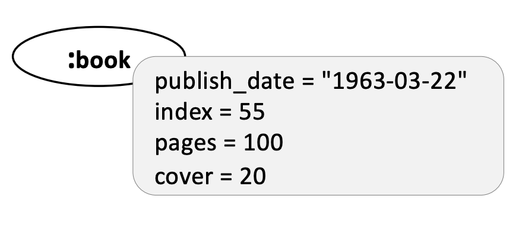
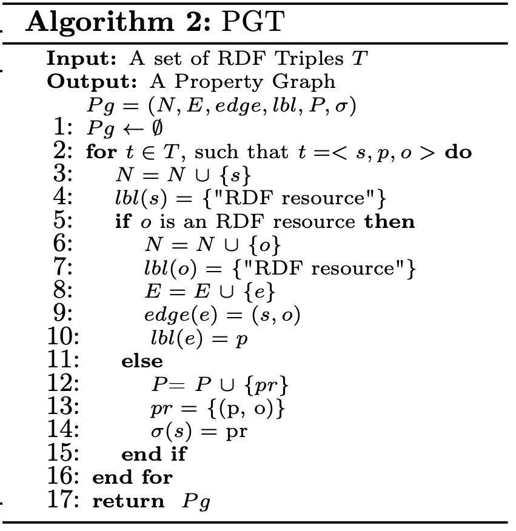
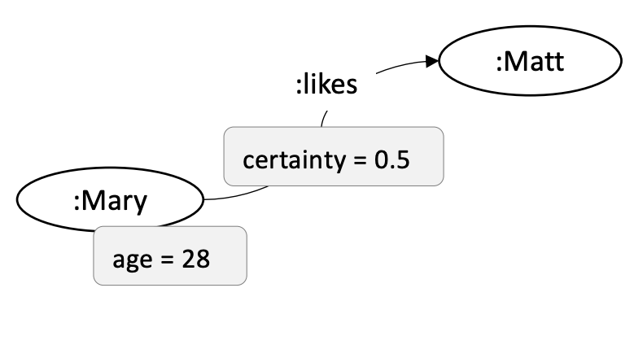
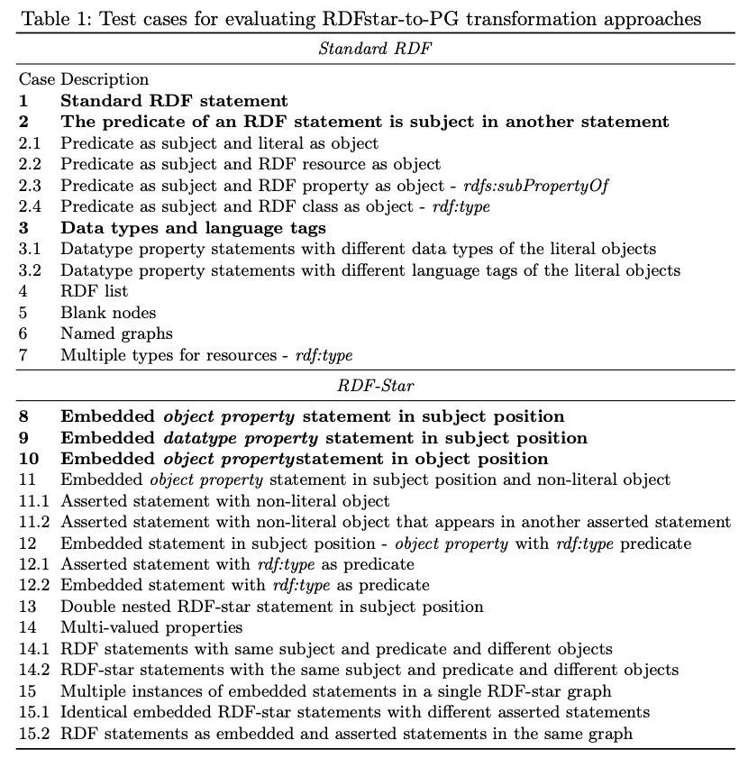

RDF to ArangoDB (PGT)
---------------------
`Same graph, but lighter`

What is PGT?
============

**PGT ensures that datatype property statements (i.e statements whose objects are Literals)
are mapped to node properties in the Property Graph (PG)**.

Consider the following RDF Graph:

.. code-block:: turtle

    @prefix ex: <http://example.org/> .
    @prefix xsd: <http://www.w3.org/2001/XMLSchema#> .

    ex:book ex:publish_date "1963-03-22"^^xsd:date .
    ex:book ex:pages "100"^^xsd:integer .
    ex:book ex:cover 20 .
    ex:book ex:index 55 .

PGT creates a PG consisting of a single node respresenting the RDF resource ``(ex:book)`` with
multiple properties representing property-object pairs from the RDF statements, such as ``(ex:index,55)``.
Distinguishing between **datatype** and **object property** statements, this approach transforms object
property statements to edges and datatype property statements to properties of the node representing the subject.
Unlike RPT, the resulting PG nodes represent only RDF resources or blank nodes while Literal Objects will
become properties:

The Algorithm belows formalizes the PGT approach. For each triple, check the type of the statement's object
(line 5), and based on that, decide to either create a node (if it does not yet exist, line 6) or
a property (line 13).

Now, consider the following RDF-star Graph:

.. code-block::

    @prefix ex: <http://example.com/> .

    << ex:Mary ex:likes ex:Matt >> ex:certainty 0.5 .
    << ex:Mary ex:age 28 >> ex:certainty 1 .

PGT transforms the embedded triple depending on its object; if it is an RDF resource, PGT converts it to an
edge. Otherwise, it converts the embedded triple into a node with a property
(lines 6-11) and fails to transform the asserted triple. The transformation of the triples from using PGT
results in a PG with a single node that makes it impossible to represent the ``(ex:certainty 1)`` triple,
since PGs do not support properties over other properties:

**Please Note:** The ``rdflib`` python package hasn't yet introduced support for
`Quoted Triples <https://www.w3.org/TR/rdf12-concepts/#dfn-quoted-triple>`_, so 
ArangoRDF's support for RDF-star is based on `Triple Reification <https://www.w3.org/wiki/RdfReification>`_.

As a result, the RDF-star Graph above can be processed with ArangoRDF as follows:

.. code-block:: python

    from rdflib import Graph
    from arango import ArangoClient
    from arango_rdf import ArangoRDF

    data = """
        @prefix ex: <http://example.com/> .
        @prefix rdf: <http://www.w3.org/1999/02/22-rdf-syntax-ns#> .

        # << ex:Mary ex:likes ex:Matt >> ex:certainty 0.5 .
        # << ex:Mary ex:age 28 >> ex:certainty 1 .

        [] a rdf:Statement;
            rdf:subject ex:Mary;
            rdf:predicate ex:likes;
            rdf:object ex:Matt ;
            ex:certainty 0.5 .
        
        [] a rdf:Statement;
            rdf:subject ex:Mary;
            rdf:predicate ex:age;
            rdf:object 28 ;
            ex:certainty 1 .
    """

    rdf_graph = Graph()
    rdf_graph.parse(data=data, format="turtle")

    db = ArangoClient().db()
    adbrdf = ArangoRDF(db)
    adbrdf.rdf_to_arangodb_by_pgt(name="DataPGT", rdf_graph=rdf_graph, overwrite_graph=True)

ArangoDB Collection Mapping Process
====================================

The **ArangoDB Collection Mapping Process** is defined as the algorithm used to map
RDF Resources to ArangoDB Collections. In PGT, the ArangoDB Collections generated are
are based on the ``rdf:type`` nature of the RDF Resource / Statement.

Let's consider the following RDF Graph:

.. code-block:: turtle

    @prefix ex: <http://example.com/> .
    @prefix adb: <http://www.arangodb.com/> .
    @prefix rdfs: <http://www.w3.org/2000/01/rdf-schema#> .
    @prefix rdf: <http://www.w3.org/1999/02/22-rdf-syntax-ns#> .

    ex:B rdfs:subClassOf ex:A .
    ex:C rdfs:subClassOf ex:A .
    ex:D rdfs:subClassOf ex:C .

    ex:alex rdf:type ex:A .

    ex:sam ex:age 25 .
    ex:age rdfs:domain ex:A .

    ex:john rdf:type ex:B .
    ex:john rdf:type ex:D .

    ex:mike rdf:type ex:G .
    ex:mike rdf:type ex:F .
    ex:mike rdf:type ex:E .

    ex:frank adb:collection "Z" .
    ex:frank rdf:type ex:D .

    ex:bob ex:name "Bob" .

    ex:alex ex:knows ex:bob .

The PGT ArangoDB Collection Mapping Process would produce the following ArangoDB Collections:

1. A (Vertex Collection)
- ``ex:alex``
- ``ex:sam``: Although this RDF Resource has no ``rdf:type`` associated statement, we can infer from the domain of the property it uses (``ex:age``) that it is of type ``ex:A``.

2. D (Vertex Collection)
- ``ex:john``: This RDF Resource has 2 ``rdf:type`` statements, but ``ex:D`` is more verbose than ``ex:B`` according to the ``rdfs:subClassOf`` Taxonomy.

2. E (Vertex Collection)
- ``ex:mike``: This RDF Resource has multiple ``rdf:type`` statements, with
none belonging to the ``rdfs:subClassOf`` Taxonomy.
Therefore, the objects are sorted alphabetically, and ``ex:E`` is the first
in the list.

3. Z (Vertex Collection)
- ``ex:frank``: This RDF Resource has an ``adb:collection`` statement associated
to it, which is prioritized over any other ``rdf:type``
statement it may have. Think of it as an override mechanism to any
other ``rdf:type`` statement.

4. UnknownResource (Vertex Collection)
- ``ex:bob``: This RDF Resource has neither an ``rdf:type`` statement,
nor an ``adb:collection`` statement associated to it. It
is therefore placed under the ``UnknownResource`` Collection.

5. knows (Edge Collection)
- ``ex:alex ex:knows ex:bob``: This RDF Resource is an edge, and therefore is placed under the
``knows`` Edge Collection. The local name of the predicate is **always** used
as the name of the Edge Collection.

Thus, we can formalize the ArangoDB Collection Mapping Process as follows:

1. Any RDF Statement of the form ``(subject <http://www.arangodb.com/collection> "X")``
will map the Subject to the ArangoDB Vertex Collection ``X``.

2. If 1. is not satisfied, then any RDF Statement of the form
``(subject <http://www.w3.org/1999/02/22-rdf-syntax-ns#type> object)``
are considered in the following way:

2.1. If an RDF Resource only has one `rdf:type` statement,
then the local name of the RDF Object is used as the ArangoDB
Document Collection name. For example,
``(<http://example.com/Bob> <rdf:type> <http://example.com/Person>)``
would create an JSON Document for ``<http://example.com/Bob>``,
and place it under the "Person" Document Collection.
**NOTE**: The RDF Object will also have its own JSON Document
created, and will be placed under the ``"Class"``
Document Collection.

2.2 If an RDF Resource has multiple ``rdf:type`` statements,
with some (or all) of the RDF Objects of those statements
belonging in an ``rdfs:subClassOf`` Taxonomy, then the
local name of the "most specific" Class within the Taxonomy is
used (i.e the Class with the biggest depth). If there is a
tie between 2+ Classes, then the URIs are alphabetically
sorted & the first one is picked.

2.3 If an RDF Resource has multiple ``rdf:type`` statements, with
none of the RDF Objects of those statements belonging in an
``rdfs:subClassOf`` Taxonomy, then the URIs are
alphabetically sorted & the first one is picked. The local
name of the selected URI will be designated as the Document
collection for that Resource.

**Final Remarks**

We are welcome to suggestions on how to improve the ArangoDB Collection Mapping Process for PGT,
as we understand that it is not perfect. 

Consider overriding the `ArangoRDFController <./specs.html#arango_rdf.controller.ArangoRDFController>`_ Class
to implement your own ArangoDB Collection Mapping Process for PGT.

Supported Cases
===============

**Note**: RDF-to-ArangoDB functionality has been implemented using concepts described in the paper
`Transforming RDF-star to Property Graphs: A Preliminary Analysis of Transformation Approaches 
<https://arxiv.org/abs/2210.05781>`_. 

The paper presents a systematic list of test cases that transformation approaches need to fulfill. These
test cases range from simple RDF Graphs to complex RDF-star Graphs.

ArangoRDF's PGT interface can be observed `here <./specs.html#arango_rdf.main.ArangoRDF.rdf_to_arangodb_by_pgt>`_.

`View how ArangoRDF's PGT transformation approach performs on these test cases in 
Colab <https://colab.research.google.com/github/ArangoDB-Community/ArangoRDF/blob/main/examples/ArangoRDF.ipynb#scrollTo=cy_BWXK2AX5n>`_.

