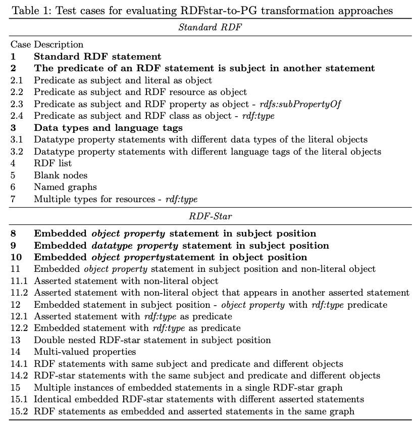

RDF to ArangoDB (RPT)
---------------------
`Virtualizng ArangoDB as a Triple Store`

What is RPT?
============

**The RDF-topology Preserving Transformation (RPT) algorithm preserves the
RDF graph structure by transforming each RDF statement into an edge in the Property Graph (PG).**

Consider the following RDF Graph:

.. code-block:: turtle

    @prefix ex: <http://example.org/> .
    @prefix xsd: <http://www.w3.org/2001/XMLSchema#> .

    ex:book ex:publish_date "1963-03-22"^^xsd:date .
    ex:book ex:pages "100"^^xsd:integer .
    ex:book ex:cover 20 .
    ex:book ex:index 55 .

RPT converts the triple ``(ex:book, ex:index, 55)`` into two
nodes ``(ex:book)`` and ``(55)``, connected by an edge ``(ex:index)``. All other triples
involving RDF resources, blank nodes, or literal values can be transformed in
a similar way so that we obtain the Property Graph below:

The Algorithm below formalizes the RPT approach. For each triple, create a node for the subject (line
3) and the object (line 5), with an edge connecting them (line 12) - of course avoiding duplicate
nodes for the same IRIs.

Now, consider the following RDF-star Graph:

.. code-block::

    @prefix ex: <http://example.com/> .

    << ex:Mary ex:likes ex:Matt >> ex:certainty 0.5 .
    << ex:Mary ex:age 28 >> ex:certainty 1 .

ArangoRDF's RPT transformation for RDF-star Graphs is slightly different from the
transformation proposed in the paper. In order to preserve the concept of **virtualizing ArangoDB
as a Triple Store**, conversion for RDF-star statements is identical to RDF triples. This is not
the case for the RPT transformation proposed in the paper, which proposes to add the `ex:certainty 1` as 
an edge attribute to the edge connecting the nodes `ex:Mary` and `28`. Instead, ArangoRDF's RPT
transformation expresses ``(..., ex:certainty, 1)`` as its own edge:

**Please Note:** The ``rdflib`` python package hasn't yet introduced support for
`Quoted Triples <https://www.w3.org/TR/rdf12-concepts/#dfn-quoted-triple>`_, so 
ArangoRDF's support for RDF-star is based on `Triple Reification <https://www.w3.org/wiki/RdfReification>`_.

As a result, the RDF-star Graph above can be processed with ArangoRDF as follows:

.. code-block:: python

    from rdflib import Graph
    from arango import ArangoClient
    from arango_rdf import ArangoRDF

    data = """
        @prefix ex: <http://example.com/> .
        @prefix rdf: <http://www.w3.org/1999/02/22-rdf-syntax-ns#> .

        # << ex:Mary ex:likes ex:Matt >> ex:certainty 0.5 .
        # << ex:Mary ex:age 28 >> ex:certainty 1 .

        [] a rdf:Statement;
            rdf:subject ex:Mary;
            rdf:predicate ex:likes;
            rdf:object ex:Matt ;
            ex:certainty 0.5 .
        
        [] a rdf:Statement;
            rdf:subject ex:Mary;
            rdf:predicate ex:age;
            rdf:object 28 ;
            ex:certainty 1 .
    """

    rdf_graph = Graph()
    rdf_graph.parse(data=data, format="turtle")

    db = ArangoClient().db()
    adbrdf = ArangoRDF(db)
    adbrdf.rdf_to_arangodb_by_rpt(name="DataRPT", rdf_graph=rdf_graph, overwrite_graph=True)

ArangoDB Collection Mapping Process
===================================

The **ArangoDB Collection Mapping Process** is defined as the algorithm used to map
RDF Resources to ArangoDB Collections. In RPT, the ArangoDB Collections generated are
consistent:

1. ``{Name}_URIRef``: The Vertex collection for ``rdflib.term.URIRef`` resources.
2. ``{Name}_BNode``: The Vertex collection for ``rdflib.term.BNode`` resources.
3. ``{Name}_Literal``: The Vertex collection for ``rdflib.term.Literal`` resources.
4. ``{Name}_Statement``: The Edge collection for all triples/quads.

Using the python example from above, the RDF Resources of your RDF Graph would be stored under the following ArangoDB Collections:

1. DataRPT_URIRef
    - ``ex:Mary``
    - ``ex:Matt``
2. DataRPT_BNode
    - ``[]`` (1)
    - ``[]`` (2)
3. DataRPT_Literal
    - ``0.5``
    - ``1``
4. DataRPT_Statement
    - ``ex:Mary -> ex:likes -> ex:Matt``
    - ``ex:Mary -> ex:age -> 28``
    - ``(ex:Mary -> ex:likes -> ex:Matt) -> ex:certainty -> 0.5``
    - ``(ex:Mary -> ex:age -> 28) -> ex:certainty -> 1``

This is the consistent naming scheme for all ArangoRDF RPT transformations. The name of the
RDF Graph is used as a prefix for the 3 Vertex Collections and the 1 Edge Collection.

Supported Cases
===============

**Note**: RDF-to-ArangoDB functionality has been implemented using concepts described in the paper
`Transforming RDF-star to Property Graphs: A Preliminary Analysis of Transformation Approaches 
<https://arxiv.org/abs/2210.05781>`_. 

The paper presents a systematic list of test cases that transformation approaches need to fulfill. These
test cases range from simple RDF Graphs to complex RDF-star Graphs.

ArangoRDF's RPT interface can be observed `here <./specs.html#arango_rdf.main.ArangoRDF.rdf_to_arangodb_by_rpt>`_.

`View how ArangoRDF's RPT transformation approach performs on these test cases in 
Colab <https://colab.research.google.com/github/ArangoDB-Community/ArangoRDF/blob/main/examples/ArangoRDF.ipynb#scrollTo=cy_BWXK2AX5n>`_.

